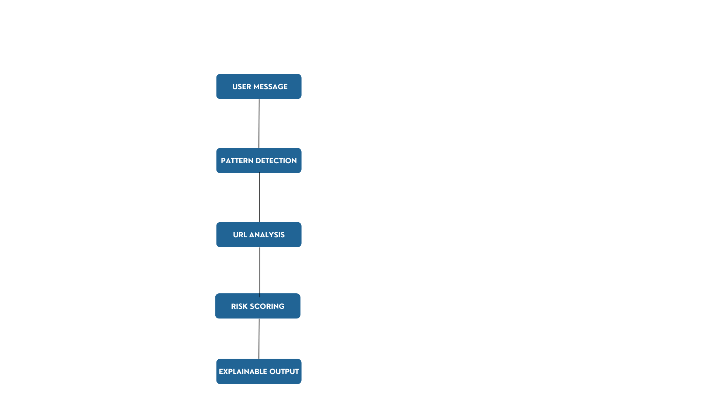
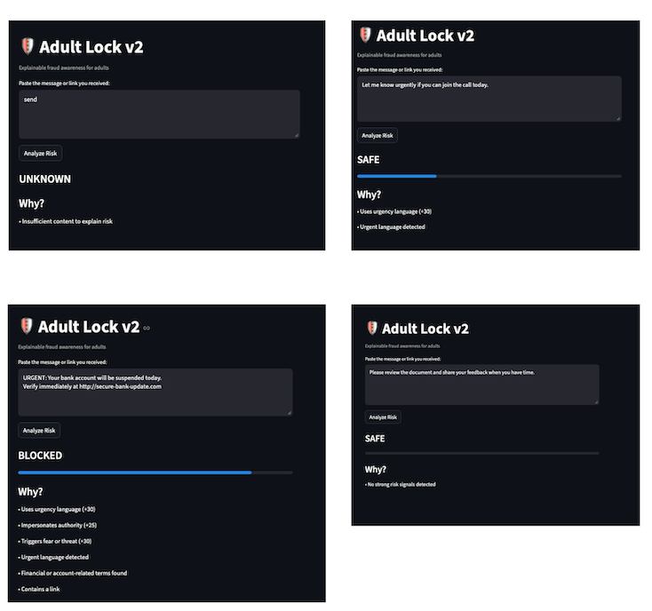

# 🛡️ Adult Lock

Adult Lock is an explainable fraud awareness tool that detects phishing and scam messages using hybrid rule-based and machine learning analysis.

## Features

- Detects phishing & scam messages
- Hybrid rule-based + ML scoring
- Explainable risk reasoning
- Suspicious link detection
- Urgency & authority impersonation detection
- Clean Streamlit UI

## How it Works

1. Rules engine detects scam patterns
2. ML model identifies phishing language patterns
3. Ensemble scoring calculates final risk
4. Explainability layer shows why the message is risky

## Run Locally

```bash
pip install -r requirements.txt
streamlit run app.py


-----------------------------------------------------------------------------------------------------------------

#v2.3 – Explainability
- Transparent risk reasons
- Urgency, authority, fear & reward signals
- Safe handling of unknown/short inputs

## 🚀 Version 2.1 Highlights
- Weighted risk scoring
- URL intelligence
- Explainable, human-readable output
- Improved UI clarity for adults




# 🛡️ Adult Lock

Adult Lock v2.1 is an explainable fraud awareness tool that helps adults pause and think before interacting with suspicious messages or links.


## 🚩 Problem
Due to rise in onnline fraud for the elderly they are loosing huge amount of money, privacy and what not. We cannot monitor their phone all the time to be sure they accidently dont click on a malecious link which came via a message or an email. 

## 💡 Solution
Adult lock is a solution which without reading your message or emails, without asking for access permisions ask the users to paste the message and give them an indication of wheather the message is fraud or real.

## ⚙️ How It Works
- Rule-based detection
- Risk scoring
- Human-readable explanation

## 🧠 Why Explainable AI?
Trust > accuracy in early-stage safety systems.





## 🚀 Future Scope
- ML integration
- Browser extension
- URL reputation checks

2️⃣ VERSION 0.2 → 1.0 ROADMAP

This shows product leadership thinking.

You don’t need to build it yet — just show clarity.

🧭 Adult Lock Roadmap
🔹 Version 0.2 — Smarter Awareness

Weighted risk scoring

Message confidence explanation

Reduced false positives

More scam pattern categories

🔹 Version 0.3 — Trust Expansion

URL domain inspection

Known scam pattern library

User feedback loop (“Was this useful?”)

🔹 Version 0.5 — Intelligence Layer

Dataset creation (scam vs legitimate)

Basic ML classifier

Confidence-based warnings

🔹 Version 1.0 — Real-World Usage

Browser extension prototype

SMS sharing integration

Lightweight backend

Privacy-first design
